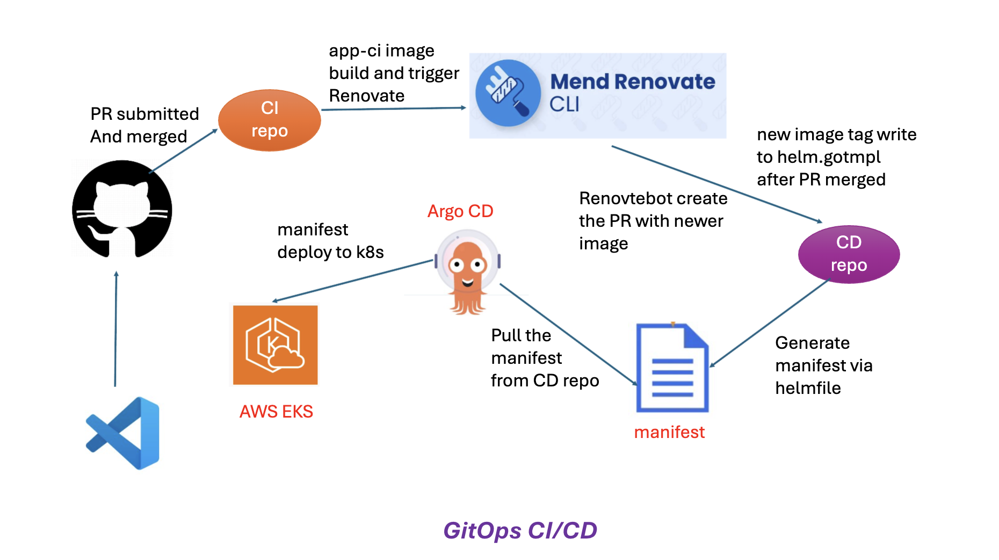

# python flask app CI

This repo is for Python app build and docker build with a semantic version control then push the image to Dockerhub, finally trigger RUN Renovate in the Gitops CD repo.

## GitOps Design Architecture



## Usage

- Prepare python virtural environment
```shell
python3 -m venv venv
```
- Activate virtural environment
```shell
source venv/bin/activate
```
- Install requirements.txt
```shell
pip install -r requirements.txt
```


